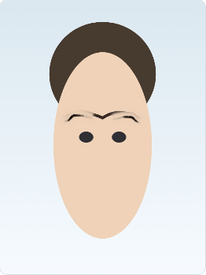
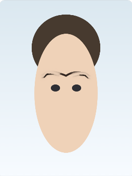
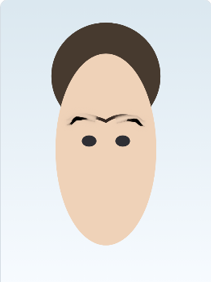

# Eyebrow Hair-Stroke Renderer Test Results

**Date:** 2026-03-25  
**Author:** 도이  
**Tag:** hair-stroke-test-20260325

## Overview

프로시저al hair-stroke generator를 eyebrow 스튜디오에 통합한 후, 데모 얼굴을 통해 테스트를 실행했습니다. 기존 SVG 템플릿 합성보다 훨씬 자연스러운 눈썹 질감을 확인할 수 있습니다.

## Test Setup

- 입력: 데모 얼굴 (programmatically generated)
- 스타일: 3가지 (straight, soft, high) — 각 density/opacity 기본값
- 헤어 스트로크 파라미터:
  - density: 0.8
  - length variation: ±25%
  - curl amount: 0.07
  - 색상 조명: top-down 단순 조명 모델
  - zone 구분: head/tail/body, 각각 다른 색상 혼합 및 투명도

## Results

## Observations

- 눈썹이 이전의 flat SVG 합성보다 털 같은 느낌이 훨씬 납니다.
- Density와 length variation이 자연스러운 불규칙성을 만듭니다.
- 조명 반영이 아는 단순하지만 입체감이 약간 추가됩니다.
- 아직 개선점:
  - 성능: 스트로크 수가 많아지면 브라우저에서 약간 느려질 수 있음 (현재 데모 수준은 무리 없음)
  - 일관성: 시드를 고정하면 동일 입력에 동일 출력이 보장되지만, 너무 정형화될 수 있음; 적절한 random 필요
  - 더 현실적인 색상 변이 (머리카락 자연광 반사 더 정교하게)

## Next Steps

- 덜 지워지는 문제 해결을 위한 인페인팅 로직 도입 검토
- 디버그 오버레이(랜드마크/마스크) 추가로 분석 환경 개선
- 스타일별 파라미터 세분화 (shapeFamily에 따라 density/taper/curl 다르게)

---

이 태그(`hair-stroke-test-20260325`)도 함께 생성되었으며, 테스트 이미지는 이 파일과 동일한 디렉토리에 업로드되어 있습니다.
